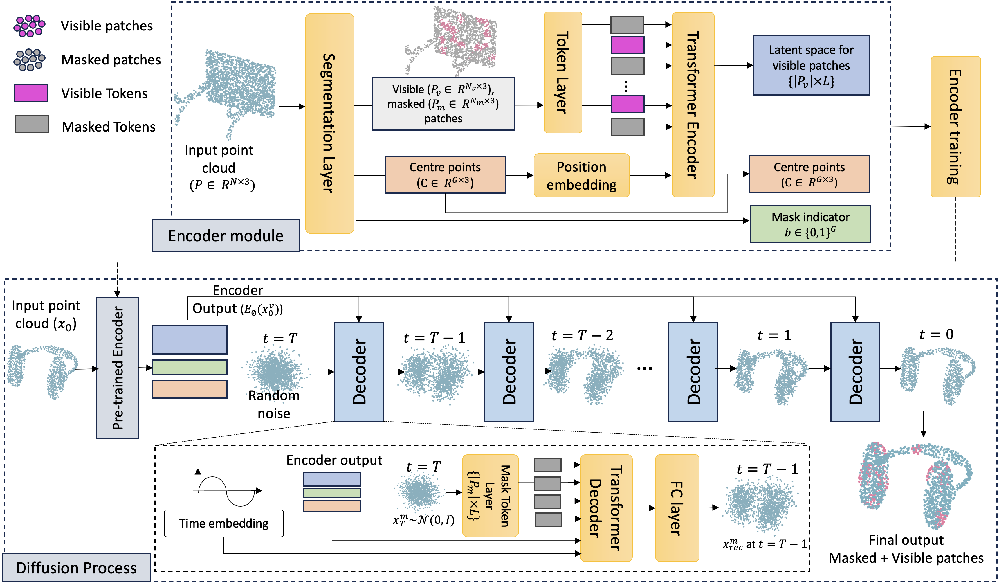

# DiffPMAE

In this work, we propose an effective point cloud reconstruction architecture, DiffPMAE. 
Inspired by self-supervised learning concepts, we combine Masked Auto-Encoding and Diffusion 
Model mechanism to remotely reconstruct point cloud data. DiffPMAE can be extended to many related 
downstream tasks including point cloud compression, upsampling and completion with minimal modifications. 

<p align="center">

</p>

GitHub repo: [https://github.com/DiffPMAE/DiffPMAE](https://github.com/DiffPMAE/DiffPMAE)

## Datasets
We use ShapeNet-55 and ModelNet40 for train and validation of the models and PU1K for upsampling validation. 
All dataset should be placed in the folder below and that will be read by scripts automatically.</br>
The overall directory structure should be:
```
│DiffPMAE/
├──dataset/
│   ├──ModelNet/
│   ├──PU1K/
│   └──ShapeNet55/
├──.......
```

### ShapeNet-55:

```
│ShapeNet55/
├──ShapeNet-55/
│  ├── train.txt
│  └── test.txt
├──shapenet_pc/
│  ├── 02691156-1a04e3eab45ca15dd86060f189eb133.npy
│  ├── 02691156-1a6ad7a24bb89733f412783097373bdc.npy
│  ├── .......
```
Download: You can download the processed ShapeNet55 dataset from [Point-BERT](https://github.com/lulutang0608/Point-BERT/blob/49e2c7407d351ce8fe65764bbddd5d9c0e0a4c52/DATASET.md)

### ModelNet40:

```
│ModelNet40/
├──modelnet40_shape_names.txt
├──modelnet40_test.txt
├──modelnet40_test_8192pts_fps.dat
├──modelnet40_train.txt
└──modelnet40_train_8192pts_fps.dat
```
Download: You can download the processed ModelNet40 dataset from [Point-BERT](https://github.com/lulutang0608/Point-BERT/blob/49e2c7407d351ce8fe65764bbddd5d9c0e0a4c52/DATASET.md)

### PU1K:

```
│PU1K/
├──test/
│  ├── input_256/
│  ├── input_512/
│  ├── input_1024/
│  ├── input_2048/
│  │   ├── gt_8192/
│  │   │   ├── 11509_Panda_v4.xyz
│  │   │   ├── .......
│  │   ├── input_2048/  
│  │   │   ├── 11509_Panda_v4.xyz
│  │   │   ├── .......  
│  └── original_meshes/
│  │   ├── 11509_Panda_v4.off
│  │   ├── ....... 
├──train/
│  └── pu1k_poisson_256_poisson_1024_pc_2500_patch50_addpugan.h5

```
Download: You can download the processed PU1K dataset from [PU-GCN](https://github.com/guochengqian/PU-GCN)

## Requirements
python >= 3.7</br>
pytorch >= 1.13.1</br>
CUDA >= 11.6
```
pip install -r requirements.txt
```

```
# PointNet++
pip install "git+https://github.com/erikwijmans/Pointnet2_PyTorch.git#egg=pointnet2_ops&subdirectory=pointnet2_ops_lib"
# GPU kNN
pip install --upgrade https://github.com/unlimblue/KNN_CUDA/releases/download/0.2/KNN_CUDA-0.2-py3-none-any.whl
```
## Pre-trained Models

Pre-trained models can be downloaded from [Google Drive](https://drive.google.com/drive/folders/1lkEursyogjBY6HgjPwP6Gy33Y833nQOG?usp=sharing)

The overall directory structure should be:
```
│DiffPMAE/
├──dataset/
├──pretrain_model/
│   ├──completion/
│   ├──compress/
│   ├──pretrain/
│   └──sr/
├──.......
```
## Training

For training, you should train the Encoder first by using the command below. Then use pre-trained
Encoder to train a decoder.

For encoder:

```
CUDA_VISIBLE_DEVICES=<GPU> python train_encoder.py
```

Hyperparameter setting can be adjusted in train_encoder.py:

```python
# Experiment setting
parser.add_argument('--batch_size', type=int, default=4)
parser.add_argument('--val_batch_size', type=int, default=1)
parser.add_argument('--device', type=str, default='cuda')  # mps for mac
parser.add_argument('--save_dir', type=str, default='./results')
parser.add_argument('--log', type=bool, default=False)

# Grouping setting
parser.add_argument('--mask_type', type=str, default='rand')
parser.add_argument('--mask_ratio', type=float, default=0.75)
parser.add_argument('--group_size', type=int, default=32)
parser.add_argument('--num_group', type=int, default=64)
parser.add_argument('--num_points', type=int, default=2048)
parser.add_argument('--num_output', type=int, default=8192)

# Transformer setting
parser.add_argument('--trans_dim', type=int, default=384)
parser.add_argument('--depth', type=int, default=12)
parser.add_argument('--drop_path_rate', type=float, default=0.1)
parser.add_argument('--num_heads', type=int, default=6)

# Encoder setting
parser.add_argument('--encoder_dims', type=int, default=384)
parser.add_argument('--loss', type=str, default='cdl2')

# sche / optim
parser.add_argument('--learning_rate', type=float, default=0.001)
parser.add_argument('--weight_decay', type=float, default=0.05)
parser.add_argument('--eta_min', type=float, default=0.000001)
parser.add_argument('--t_max', type=float, default=200)
```

For decoder:

```
CUDA_VISIBLE_DEVICES=<GPU> python train_decoder.py
```

To load the pre-trained Encoder, you can change the following in train_decoder.py:

```python
check_point_dir = os.path.join('./pretrain_model/pretrain/encoder.pt')

check_point = torch.load(check_point_dir)['model']
encoder = Encoder_Module(args).to(args.device)
encoder.load_state_dict(check_point)
```

Hyperparameter setting for Decoder can be adjusted in train_decoder.py:

```python
# Experiment setting
parser.add_argument('--batch_size', type=int, default=32)
parser.add_argument('--val_batch_size', type=int, default=1)
parser.add_argument('--device', type=str, default='cuda')  # mps for mac
parser.add_argument('--log', type=bool, default=True)
parser.add_argument('--save_dir', type=str, default='./results')

# Grouping setting
parser.add_argument('--mask_type', type=str, default='rand')
parser.add_argument('--mask_ratio', type=float, default=0.75)
parser.add_argument('--group_size', type=int, default=32) # points in each group
parser.add_argument('--num_group', type=int, default=64) # number of group
parser.add_argument('--num_points', type=int, default=2048)
parser.add_argument('--num_output', type=int, default=8192)
parser.add_argument('--diffusion_output_size', default=2048)

# Transformer setting
parser.add_argument('--trans_dim', type=int, default=384)
parser.add_argument('--drop_path_rate', type=float, default=0.1)

# Encoder setting
parser.add_argument('--encoder_depth', type=int, default=12)
parser.add_argument('--encoder_num_heads', type=int, default=6)
parser.add_argument('--loss', type=str, default='cdl2')

# Decoder setting
parser.add_argument('--decoder_depth', type=int, default=4)
parser.add_argument('--decoder_num_heads', type=int, default=4)

# diffusion
parser.add_argument('--num_steps', type=int, default=200)
parser.add_argument('--beta_1', type=float, default=1e-4)
parser.add_argument('--beta_T', type=float, default=0.05)
parser.add_argument('--sched_mode', type=str, default='linear')

# sche / optim
parser.add_argument('--learning_rate', type=float, default=0.001)
parser.add_argument('--weight_decay', type=float, default=0.05)
parser.add_argument('--eta_min', type=float, default=0.000001)
parser.add_argument('--t_max', type=float, default=200)
```

## Evaluation
For pre-train model:

```
python eval_diffpmae.py
```

For upsampling:
```
python eval_upsampling.py
```

For compression:
```
python eval_compression.py
```

The configuration for each task can be adjusted in corresponding python file.<br>
For example, the model configuration for pre-train evaluation can be adjusted in 
eval_diffpmae.py file at L14~45.

For experiment setup:

```python
parser.add_argument('--batch_size', type=int, default=32)
# Batch size
parser.add_argument('--val_batch_size', type=int, default=1)
# Validation size
parser.add_argument('--device', type=str, default='cuda')
parser.add_argument('--log', type=bool, default=True)
# Both trained model and log will not saved when set False.
parser.add_argument('--save_dir', type=str, default='./results')
# The root directory of saved file.
```

For Grouping setting

```python
parser.add_argument('--mask_type', type=str, default='rand')
# Could be either rand or block
parser.add_argument('--mask_ratio', type=float, default=0.75)
parser.add_argument('--group_size', type=int, default=32) 
# Points in each group
parser.add_argument('--num_group', type=int, default=64) 
# Number of group
parser.add_argument('--num_points', type=int, default=2048)
# Input size of point cloud
parser.add_argument('--num_output', type=int, default=8192)
# Output size of Encoder module
parser.add_argument('--diffusion_output_size', default=2048)
#Output size of Decoder module
```

For Transformer setting

```python
parser.add_argument('--trans_dim', type=int, default=384)
# Latent size
parser.add_argument('--drop_path_rate', type=float, default=0.1)
```

For Encoder setting

```python
parser.add_argument('--encoder_depth', type=int, default=12)
# Number of blocks in Encoder Transformer
parser.add_argument('--encoder_num_heads', type=int, default=6)
# Number of heads in each Transformer block
parser.add_argument('--loss', type=str, default='cdl2')
```

For Decoder setting

```python
parser.add_argument('--decoder_depth', type=int, default=4)
# Number of blocks in Decoder Transformer
parser.add_argument('--decoder_num_heads', type=int, default=4)
# Number of heads in each Transformer block
```

For diffusion process

```python
parser.add_argument('--num_steps', type=int, default=200)
parser.add_argument('--beta_1', type=float, default=1e-4)
parser.add_argument('--beta_T', type=float, default=0.05)
parser.add_argument('--sched_mode', type=str, default='linear')
```

For optimizer and scheduler

```python
parser.add_argument('--learning_rate', type=float, default=0.001)
parser.add_argument('--weight_decay', type=float, default=0.05)
parser.add_argument('--eta_min', type=float, default=0.000001)
parser.add_argument('--t_max', type=float, default=200)
```
## Acknowledgements
Our code build based on [PointMAE](https://github.com/Pang-Yatian/Point-MAE)

## Citation
```bibtex
@inproceedings{li2024diffpmae,
    author = {Yanlong Li and Chamara Madarasingha and Kanchana Thilakarathna},
    title = {DiffPMAE: Diffusion Masked Autoencoders for Point Cloud Reconstruction},
    booktitle = {ECCV},
    year = {2024}
}
```
